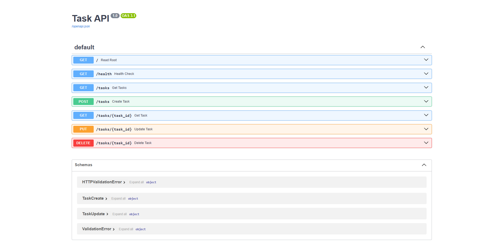

# 📝 Task API

A simple, in-memory CRUD API for managing a to-do list, built with **Python** and **FastAPI**. ⚡

This project was built for the FlyRank Internship Backend Track — Week 2, Assignment A1
("Build your first CRUD API"). It implements full Create / Read / Update / Delete
operations on a to-do list, exposes interactive documentation via Swagger UI, and stores
data in memory. 🧠

## ✨ Features

- ✅ Full CRUD on tasks: `GET`, `POST`, `PUT`, `DELETE`
- 🛡️ Input validation (empty/missing titles are rejected with `400`)
- 🚦 Proper HTTP status codes (`200`, `201`, `204`, `400`, `404`)
- 📚 Auto-generated interactive docs at `/docs` (Swagger UI) — built into FastAPI, zero setup
- 💾 In-memory storage, pre-seeded with 3 example tasks

## 🚀 How to Run

1. Install the requirements:
   ```bash
   pip install fastapi uvicorn pydantic
   ```
2. Start the server:
   ```bash
   uvicorn main:app --reload
   ```
3. The API will be available at `http://localhost:8000`. 🌐
   Interactive documentation (Swagger UI) is available at `http://localhost:8000/docs`.

## 🔌 Endpoints

| HTTP Method | Endpoint         | Description                          |
| :---------- | :--------------- | :------------------------------------ |
| GET         | `/`              | API root / info                       |
| GET         | `/health`        | Health check ❤️‍🩹                       |
| GET         | `/redis-ping`    | Redis connectivity check 🏓            |
| POST        | `/register`      | Create a new user account 🧑‍💻          |
| POST        | `/login`         | Log in, get a JWT back 🔑              |
| GET         | `/users/me`      | 🔒 Protected — who am I logged in as? |
| GET         | `/tasks`         | List all tasks 📋                     |
| GET         | `/tasks/{id}`    | Get a specific task 🔍                |
| POST        | `/tasks`         | Create a new task ➕                  |
| PUT         | `/tasks/{id}`    | Update a task (title and/or done) ✏️  |
| DELETE      | `/tasks/{id}`    | Delete a task 🗑️                      |

### 🧩 Task object

```json
{
  "id": 1,
  "title": "Buy milk",
  "done": false
}
```

## 💻 Example Requests

**➕ Create a task**

```bash
$ curl -i -X POST http://localhost:8000/tasks -H "Content-Type: application/json" -d '{"title":"Buy milk"}'

HTTP/1.1 201 Created
date: Tue, 14 Jul 2026 15:13:22 GMT
server: uvicorn
content-length: 42
content-type: application/json

{"id":4,"title":"Buy milk","done":false}
```

**🔍 Get a task that doesn't exist**

```bash
$ curl -i http://localhost:8000/tasks/99

HTTP/1.1 404 Not Found
content-type: application/json

{"detail":"Task 99 not found"}
```

**✏️ Update a task**

```bash
$ curl -i -X PUT http://localhost:8000/tasks/1 -H "Content-Type: application/json" -d '{"done":true}'

HTTP/1.1 200 OK
content-type: application/json

{"id":1,"title":"Buy milk","done":true}
```

**🗑️ Delete a task**

```bash
$ curl -i -X DELETE http://localhost:8000/tasks/1

HTTP/1.1 204 No Content
```

## 📖 Swagger UI

Visit `http://localhost:8000/docs` to see all endpoints listed with an interactive
"Try it out" button that lets you run the full CRUD cycle without curl. 🕹️



## 📌 Notes

- 💨 Data lives only in memory — restarting the server resets it back to the 3 seed tasks.
- 🛑 Validation: `POST` and `PUT` reject a missing or empty `title` with a `400` response.
- ❓ Unknown task IDs return `404` on `GET`, `PUT`, and `DELETE`.


## 🐘🐳 Assignment 2: Postgres & Docker

Week 2, Assignment A2 — swap the in-memory store for a real Postgres database, and run
the whole stack (app + database, plus a Redis stretch goal 🍒) with a single
`docker compose up`.

### 🔧 What changed

- **🗄️ Storage layer:** The in-memory Python list was replaced with a PostgreSQL
  repository built on the `psycopg` driver (`psycopg[binary]`). The FastAPI **service
  and route functions did not change** — same signatures, same status codes, same
  validation. Only the code inside each route that used to touch `tasks_db` now runs
  a SQL query against Postgres. This is the payoff of A1's layering: swapping storage
  really did only touch one file (`main.py`), and even there it's isolated to the
  data-access lines. 🎯 The old in-memory implementation is kept, commented out, in
  `main.py` for side-by-side comparison.
- **🏗️ Schema:** `init.sql` creates the `tasks` table (`id`, `title`, `done`) and is
  mounted into `/docker-entrypoint-initdb.d/`, so Postgres runs it automatically the
  first time the `db` container's volume is created.
- **🔐 Config:** The connection string and Postgres credentials live in `.env`
  (gitignored — no secrets sneaking into git history! 🙅). A `.env.example` with the
  same keys and empty values is committed so anyone cloning the repo knows what to set:
  ```
  POSTGRES_USER=
  POSTGRES_PASSWORD=
  POSTGRES_DB=
  DATABASE_URL=
  ```
  `main.py` reads `DATABASE_URL` via `os.getenv`, with a localhost fallback for running
  outside Docker.
- **🧱 Docker Compose:** `docker-compose.yml` defines three services — `db` (Postgres 15,
  with a named volume `postgres_data` for persistence and `init.sql` mounted for
  first-boot seeding), `redis` (stretch goal, see below), and `api` (built from the
  `Dockerfile`, depends on both). `docker compose up` starts the entire stack with one
  command. One command, three containers, zero drama. 😌

### ▶️ How to run it (Docker)

1. Copy `.env.example` to `.env` and fill in real values (or use the defaults already
   in `docker-compose.yml`/`main.py` for local testing).
2. `docker compose up` 🐳 — this builds the API image, starts Postgres with the volume
   mounted and `init.sql` applied on first boot, and starts Redis.
3. The API is available at `http://localhost:8000` and Swagger UI at
   `http://localhost:8000/docs`, same as before. 🎉

### 🔬 Persistence, proven

Checked by:

1. 🐳 `docker compose up` to start the stack.
2. ➕ `POST /tasks` to create a new row.
3. 👀 `GET /tasks` to confirm it's there.
4. 💥 `docker compose down` — this stops **and removes** the containers, but leaves the
   named volume (`postgres_data`) intact.
5. 🐳 `docker compose up` again.
6. 🎊 `GET /tasks` again — the new row was still there, because the data lives in the
   Docker volume, not inside the container itself. Only running `docker compose down
   -v` (which explicitly deletes volumes) would wipe it.

The data survived the apocalypse. Container restarts, no problem. 🧟➡️💾

### 🌟 Stretch goals

- **🍒 Redis:** Added as a fourth service in `docker-compose.yml`. The API connects to it
  using the `REDIS_HOST` environment variable (set to `redis`, the Compose service
  name, so containers can reach each other by name on the Docker network). A
  `GET /redis-ping` endpoint calls `redis_client.ping()` and reports back whether the
  connection is alive — this is a connectivity check only; Redis isn't yet used for
  caching in this assignment. 🏓
- **⚡ Index:** Added `idx_tasks_title` on `tasks(title)` in `init.sql` to speed up
  title-based lookups/searches as the table grows. 📈

## 🔐 Assignment 3: Authentication — "Who's calling?" 🕵️‍♀️

Week 2, Assignment A3 — teach the API to recognize *who* it's talking to. Users can now
register, log in, and get a token that proves their identity on every future request.
No more anonymous free-for-all! 🙅‍♂️

### 🔧 What changed

- **🧑‍💻 Registration:** `POST /register` takes a `username` and `password`, hashes the
  password with **bcrypt** (never, ever stored in plain text 🙈), and inserts a new row
  into a brand-new `users` table. Duplicate usernames are rejected with a friendly `400`.
- **🔑 Login:** `POST /login` checks the submitted password against the stored bcrypt
  hash and, if it matches, hands back a **JWT** (JSON Web Token) — a signed, tamper-proof
  little note that says "yep, this is really them" ✍️. Wrong username or password?
  Honest `401 Unauthorized`, every time. Note: Swagger UI's login form sends this as
  form data (not JSON), which is why `/login` uses `OAuth2PasswordRequestForm` under the
  hood — but it's the same login endpoint either way.
- **🛡️ Protected route:** `GET /users/me` only responds if you show up with a valid
  token in the `Authorization: Bearer <token>` header. No token, an expired token, or a
  garbled one? `401 Unauthorized`, politely shown the door 🚪. Got a real token? It
  greets you by name. 👋
- **🗄️ Schema:** `init.sql` adds a `users` table (`id`, `username`, `password_hash`) and
  gives `tasks` a `user_id` foreign key (`ON DELETE CASCADE`) so tasks *can* belong to a
  specific user going forward. The task routes themselves aren't scoped to the logged-in
  user yet — that ownership/isolation wiring is next on the list, not part of this
  assignment. 🧵
- **🍪 Tokens, not sessions:** No server-side session store — the JWT itself carries the
  username (`sub` claim) and an expiry (30 minutes ⏰), signed with a secret key so it
  can't be forged. Swagger UI's built-in "Authorize" button (top right of `/docs`) is
  the easiest way to paste in a token and try the protected route interactively. 🕹️

### ▶️ How to try it (Swagger UI)

1. `docker compose up` 🐳 (same as before).
2. Visit `http://localhost:8000/docs`.
3. `POST /register` with a username + password. 🧑‍💻
4. `POST /login` with the same credentials → copy the `access_token` from the response. 📋
5. Click **Authorize** 🔓 at the top of the page, paste in the token, hit Authorize.
6. `GET /users/me` → should now greet you by username instead of `401`ing. 🎉
7. Log out (or just use a bogus token) and try `/users/me` again → back to `401`,
   proving the door really is locked when you're not on the list. 🚫

### 🔬 Honest, verified 401s

Checked by:

1. 🎯 Hitting `GET /users/me` with **no token at all** → `401 Unauthorized`.
2. 🧟 Hitting it again with a **deliberately mangled token** → `401 Unauthorized`.
3. ⏳ Waiting out a token's 30-minute expiry and trying again → `401`, "Token has expired".
4. ✅ Hitting it with a **fresh, valid token** from `/login` → `200 OK` with a personal
   greeting.

No silent failures, no guessing games — the API always tells you plainly whether it
knows who you are. 🗣️

### ⚠️ A note on the secret key

The JWT signing key currently lives as a plain constant in `main.py` for simplicity in
this assignment. In a real deployment it belongs in `.env` (alongside `DATABASE_URL`)
and gets loaded via `os.getenv`, never committed to source control. Flagging it here so
future-me doesn't forget! 📝

### 🌟 What's next

- **🧍 Per-user tasks:** Wire the `tasks.user_id` column up to `get_current_user` so each
  person only sees and edits *their own* tasks — real `403 Forbidden` territory. 🚧
- **🔁 Refresh tokens:** 30 minutes is short on purpose for this assignment; a refresh
  flow would let sessions last longer without the security downsides of a
  long-lived access token.
