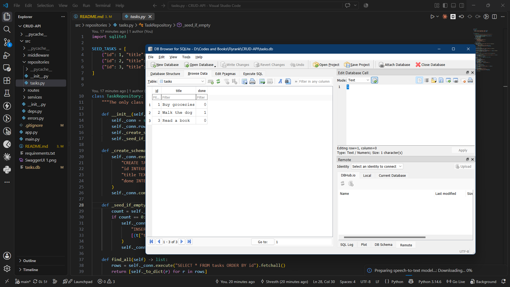
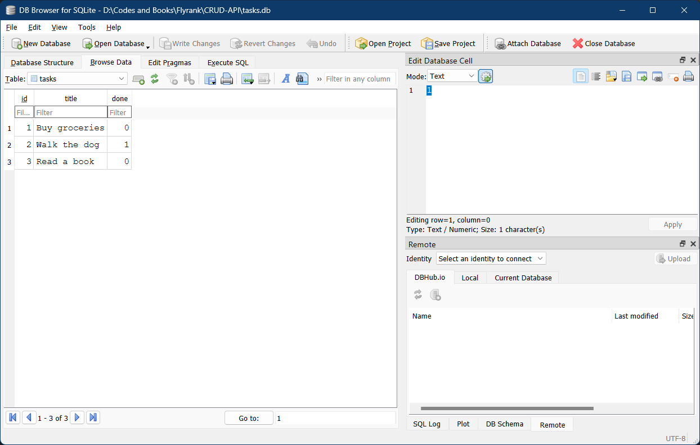

# 🗂️ Task API

A FastAPI CRUD API for managing tasks — the little promises you make to yourself and keep putting off until tomorrow. Backed by SQLite, because your to-do list deserves a home that actually remembers.

## 📁 Project structure

```text
.
├── main.py                     # starts the server — just the port
├── app.py                      # wires everything into FastAPI
├── requirements.txt            # dependencies (fastapi, uvicorn) — the only two things it needs
├── .gitignore                  # keeps tasks.db and __pycache__ out of git
├── README.md                   # this file
├── SwaggerUI 1.png             # Swagger UI screenshot
├── DBBrowser1.png              # DB Browser screenshot — table structure
├── DBBrowser2.png              # DB Browser screenshot — browsing the data
├── tasks.db                    # the SQLite database (git-ignored, created on first run)
└── src/
    ├── __init__.py             # makes src a package
    ├── routes/
    │   ├── __init__.py
    │   ├── tasks.py            # HTTP layer — the five CRUD endpoints
    │   └── extras.py           # HTTP layer — the extras (/stats, /reset), the bonus tracks
    ├── services/
    │   ├── __init__.py
    │   └── tasks.py            # business rules — the boss
    ├── repositories/
    │   ├── __init__.py
    │   └── tasks.py            # data access — the vault keepers
    ├── middleware/
    │   ├── __init__.py
    │   └── error_handler.py    # the safety net
    ├── deps.py                 # builds the repository + service, no construction hats required
    └── errors.py               # domain error types — the vocabulary of "oops"
```

## 🏗️ A1 — Build your first CRUD API

Built as Assignment A1 of the FlyRank Internship Backend Track: a CRUD API where you can create, read, update and delete tasks, see it in Swagger UI, and publish it to GitHub. This assignment, unlike the tasks in the app, actually got done.

## 🗄️ A2 — Connecting your CRUD to the database

Built as Assignment A2 of the FlyRank Internship Backend Track: A1's endpoints, now connected to a real SQLite database — the tasks finally have somewhere to call home, and it's a place that survives a restart. Read endpoints came first (Stage 1), then inserting (`INSERT`, Stage 2), then updating and deleting with SQL (Stage 3). See [Why SQLite?](#-why-sqlite) for the reasoning, and the commit history for the stage-by-stage journey.

## 🗄️ Why SQLite?

The API used to keep its tasks in a Python list in memory — restart the server and everything was gone. The list had all the staying power of a New Year's resolution. SQLite was chosen as the replacement because:

- It's a **real SQL database** that still fits a small local project — no separate database server to install or run, just a library (Python's built-in `sqlite3`) and a file
- Data **survives server restarts** (unlike the old in-memory list)
- It's enough SQL to practice `SELECT`, `INSERT`, `UPDATE`, and `DELETE` without the overhead of Postgres or MySQL

## 🐘 Why Postgres (eventually)?

Postgres is the standard choice for production apps — the grown-up in the database room. The reasons to reach for it once this project grows up:

- **Concurrency** — SQLite locks the whole database on writes; Postgres handles many writers at once, so it's required once the app has multiple users or instances
- **Networking** — Postgres is a server apps connect to over the network; SQLite is a single file (fine for one local process, impossible to share across machines)
- **Robustness** — crash recovery, roles/permissions, and battle-tested for data you can't afford to lose
- **Extras** — JSON, full-text search, advanced indexing, and tooling (backups, monitoring) when the data outgrows a toy

SQLite was right for the assignment (zero setup, real SQL). Postgres is the upgrade path — and since the API is layered (`src/repositories/`), swapping the database layer is the only thing that would change.

## 📄 Database file

Tasks are stored in `tasks.db` in the project root (next to `main.py`).

The file is created automatically the first time the app starts, with the table and three example tasks seeded on that first run — and only on the first run. It's listed in `.gitignore`, so each clone starts fresh with its own database.

The table is created only if it doesn't exist, and the seed only runs when the table is empty — restarting a hundred times still gives you exactly three tasks. Consistency is the seed of good database design.

## 🚀 Getting started

Install dependencies:

```bash
pip install -r requirements.txt
```

Start the server:

```bash
python3 main.py
```

The API runs at http://localhost:8000. Interactive docs (Swagger UI) are at http://localhost:8000/docs — generated by FastAPI from the code.

## 📋 Endpoints — one table to rule them all

| Method | Path | Description |
| --- | --- | --- |
| GET | `/` | Returns metadata about the API |
| GET | `/health` | Health check endpoint |
| GET | `/tasks` | Returns all tasks. Optional `done` and `search` query parameters filter the list |
| GET | `/tasks/{id}` | Returns a single task by id |
| POST | `/tasks` | Creates a new task (`{"title": "Buy milk"}`) |
| PUT | `/tasks/{id}` | Updates a task's `title` and/or `done` |
| DELETE | `/tasks/{id}` | Deletes a task |
| GET | `/stats` | Returns computed counts for the current task list |
| POST | `/reset` | Restores the three seed example tasks |

### GET /

Returns metadata about the API. Meta, isn't it?

Response

```json
{
  "name": "Task API",
  "version": "1.0",
  "endpoints": ["/tasks"]
}
```

### GET /health

Health check endpoint — the API's annual physical. Returns the server status so you know it's alive and well.

Response

```json
{ "status": "ok" }
```

### GET /tasks

Returns all tasks, sorted alphabetically by title — because even a to-do list deserves some order in its life. Optional query parameters filter the list in the database itself (the part after `?` — filters, not questions):

| Query | Example | Effect |
| --- | --- | --- |
| `done` | `?done=true` | Only finished tasks |
| `done` | `?done=false` | Only open tasks |
| `search` | `?search=milk` | Title contains the word (case-insensitive `LIKE`) |

Filters can be combined: `?done=false&search=book`. Filter first, panic later.

Response

```json
[
  { "id": 1, "title": "Buy groceries", "done": false, "created_at": "2026-08-01 09:15:00", "updated_at": "2026-08-01 09:15:00" },
  { "id": 3, "title": "Read a book", "done": false, "created_at": "2026-08-01 09:15:00", "updated_at": "2026-08-01 09:15:00" },
  { "id": 2, "title": "Walk the dog", "done": true, "created_at": "2026-08-01 09:15:00", "updated_at": "2026-08-01 10:02:11" }
]
```

### GET /tasks/{id}

One task to rule them all — well, one task, period. Returns it by id.

Response (200)

```json
{ "id": 1, "title": "Buy groceries", "done": false, "created_at": "2026-08-01 09:15:00", "updated_at": "2026-08-01 09:15:00" }
```

Response (404)

```json
{ "error": "Task 99 not found" }
```

Task 99 is probably on a beach somewhere, sipping a piña colada. 🏖️

### POST /tasks

A new task is born. 👶 The server gives it the next free id and sets `done` to `false` — because no task starts its life already finished.

Request body

```json
{ "title": "Buy milk" }
```

Response (201)

```json
{ "id": 4, "title": "Buy milk", "done": false, "created_at": "2026-08-01 11:20:00", "updated_at": "2026-08-01 11:20:00" }
```

Response (400)

```json
{ "error": "title is required and cannot be empty" }
```

No title, no task. The server never trusts a nameless request. 🤨

### GET /stats

Counting tasks so you don't have to — and the database does the counting with `COUNT()` and `SUM()` in SQL, not by looping in code. It adds up.

Response

```json
{ "total": 7, "done": 3, "open": 4 }
```

Example

```bash
curl http://localhost:8000/stats
```

### POST /reset

The Ctrl+Z of your to-do list. ⌨️ Clears the database and restores the three seed example tasks with fresh timestamps. Useful for demos and testing — a clean slate, the way you've always wanted from life.

Response (200)

```json
[
  { "id": 1, "title": "Buy groceries", "done": false },
  { "id": 2, "title": "Walk the dog", "done": true },
  { "id": 3, "title": "Read a book", "done": false }
]
```

Example

```bash
curl -X POST http://localhost:8000/reset
```

### PUT /tasks/{id}

Task got a glow-up. ✨ Updates a task's `title` and/or `done`. Send one or both fields; omitted fields stay unchanged — the task's other half lives to fight another day.

Request body

```json
{ "title": "Buy oat milk", "done": true }
```

Response (200)

```json
{ "id": 1, "title": "Buy oat milk", "done": true, "created_at": "2026-08-01 09:15:00", "updated_at": "2026-08-01 11:45:00" }
```

Response (400)

```json
{ "error": "request body must include title and/or done" }
```

Response (404)

```json
{ "error": "Task 99 not found" }
```

### DELETE /tasks/{id}

Bye-bye, task. 👋 Gone faster than your New Year's resolutions. 🥂

Response (204)

Empty body — success, nothing to return. Silence is golden. 🤫

Response (404)

```json
{ "error": "Task 99 not found" }
```

## 🧾 Example

Proof it works, in black and white:

```bash
curl -i -X POST http://localhost:8000/tasks \
  -H "Content-Type: application/json" \
  -d '{"title": "Buy milk"}'
```

Output

```
HTTP/1.1 201 Created
date: Sat, 01 Aug 2026 20:03:33 GMT
server: uvicorn
content-length: 40
content-type: application/json

{"id":4,"title":"Buy milk","done":false,"created_at":"2026-08-01 11:20:00","updated_at":"2026-08-01 11:20:00"}
```

## 🎨 Swagger UI

The interactive docs in action — every endpoint, clickable and documented:


## 📊 Example SQL query

This is what `GET /tasks` runs under the hood (plus one query I ran by hand in DB Browser — no API in sight, just raw SQL and confidence):

```sql
SELECT id, title, done, created_at, updated_at FROM tasks ORDER BY title;
```

The one I ran by hand: `UPDATE tasks SET done = 1;` — it marked every task complete in a single statement, and `GET /tasks` showed the change immediately with no restart, because the API and DB Browser read the exact same file.





## 🧬 A note on migrations

Adding `created_at` and `updated_at` meant changing the table's shape: fresh databases get the columns in `CREATE TABLE`, but an existing `tasks.db` needed `ALTER TABLE` plus a backfill `UPDATE` — two different code paths for the same table, depending on its history. That feeling of "this database has a past" is exactly why migrations exist.

## 💾 Persistence

The goldfish era is over 🐠➡️🗄️: restart the server and your tasks are still there. The data now lives in `tasks.db`, a file on disk, instead of a Python list in memory — that's the entire difference between a demo and something real.